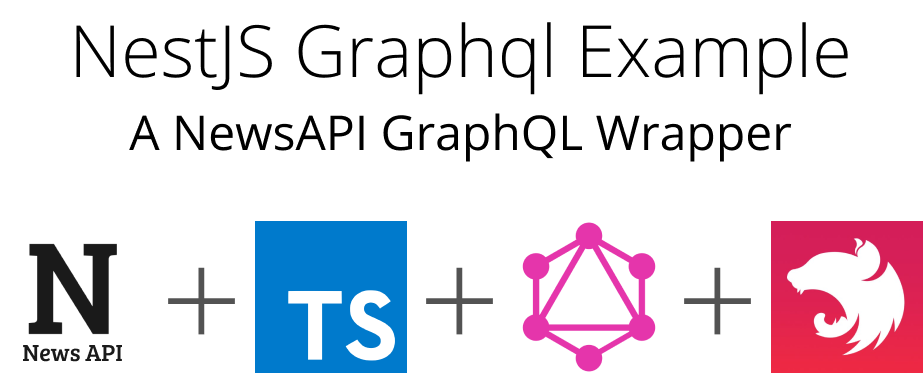

<p align="center">
  <a href="https://nestjs-graphql-example.now.sh/graphql" target="blank"></a>
</p>
<p align="center">A <a href="https://graphql.org/" target="_blank">GraphQL</a> REST wrapper example using the <a href="https://newsapi.org"
    target="_blank">NewsAPI</a> build with the <a href="https://nestjs.com/" target="_blank">NestJS</a> Framework</p>

## Demos

 <a href="https://nestjs-graphql-example.now.sh/graphql" target="_blank">
  
</a>
<br/><br/>
 <a href="https://codesandbox.io/s/42nz8kzl14?autoresize=1&expanddevtools=1&hidenavigation=1&view=editor" target="_blank">
    
  </a>

## Background

Recently came across the [NestJS](https://nestjs.org) while expirementing with different [Typescript](https://www.typescriptlang.org/) based frameworks for [GraphQL](https://graphql.org) specific use cases.

Official NestJS [Documentation for use with GraphQL](https://docs.nestjs.com/graphql/quick-start)

Official NestJS [GraphQL example](https://github.com/nestjs/nest/tree/master/sample/12-graphql-apollo)

## Prerequisites

> If you don't have a NewsAPI account or api token available, please follow the steps in order to get the app running!

### Step 1:

Login or Sign Up for [NewsAPI](https://newsapi.org)

### Step 2:

Go to [your account page](https://newsapi.org/account) and copy your API Token

**Step 3:**

Create a new `.env` file and add the following environment variable

> Note: you can rename the `.env.sample` to `.env` for the same results

```sh
NEWS_API_KEY="YOURAPIKEYHERE"
PORT=3000 # or your preferred port
```

## Installation

Clone the repo!

```bash
git clone https://github.com/rajinwonderland/nest-graphql-newsapi
```

Install dependencies

```bash
yarn
```

> OR

```bash
npm install
```

## Start the App

```bash
yarn dev
```

> OR

```bash
npm run dev
```

The browser should then open automatically on to your server's graphql-playground

> **Note**: Default playground should be avaialble at http://localhost:3000/graphql

> Unless you changed the `PORT` environment variable in which case your playground should be hosted at
> _http://localhost:${YOUR_PORT}/graphql_

## Example

### Top Headlines Example

Query for returning `TopHeadlines`

```graphql
query TopHeadlines($query: String!, $options: HeadlineInput) {
	topHeadlines(q: $query, options: $options) {
		status
		totalResults
		articles {
			title
			description
			author
		}
	}
}
```

**Variables** for our `TopHeadlines` Query

```json
{
	"query": "Starbucks",
	"options": {
		"pageSize": 5,
		"page": 1
	}
}
```

**Results** should end up showing in this sort of format

```json
{
	"data": {
		"topHeadlines": {
			"status": "ok",
			"totalResults": 3,
			"articles": [
				{
					"title": "Starbucks to report earnings after the bell",
					"description": "Starbucks will report its first-quarter earnings and revenue after the bell Thursday.",
					"author": "Amelia Lucas"
				}
			]
		}
	}
}
```

See the example on [GraphQLBin](https://www.graphqlbin.com/v2/oZQ1tP)

## Built With

- [NestJS](https://docs.nestjs.com) - A progressive Node.js framework for building efficient, reliable and scalable server-side applications.
- [NewsAPI](https://newsapi.org) - Up-to-date news headlines and metadata in JSON from 70+ popular news sites.
- [newsapi](https://www.npmjs.com/package/newsapi)- A node interface for NewsAPI.
- [GraphQL](https://graphql.org/) a query language for your API
- [Typescript](https://github.com/Microsoft/TypeScript) a superset of JavaScript that compiles to clean JavaScript output
- [CodeSandbox](https://codesandbox.io) is an online code editor with a focus on creating and sharing web application projects.
- [Apollo Server 2](https://www.apollographql.com/docs/apollo-server/) the best way to quickly build a production-ready, self-documenting API for GraphQL clients, using data from any source.
- [GraphQL-Playground](https://github.com/prisma/graphql-playground) a GraphQL IDE for better development workflows (GraphQL Subscriptions, interactive docs & collaboration).

## Here to Help!

If anyone is looking for some support (i.e either an example, or an open-source project) feel free to reach out to me and I'll do my best to help!


### [Raj Singh](https://github.com/rajinwonderland)

[](https://github.com/rajinwonderland)

[](https://twitter.com/rajinwonderland)

---

<p align="right">Powered by <a href="https://newsapi.org" target="_blank">NewsAPI.org</a>
</p>
<br/>
<p align="center"><a href="https://www.novvum.io" target="_blank"></a></p>
