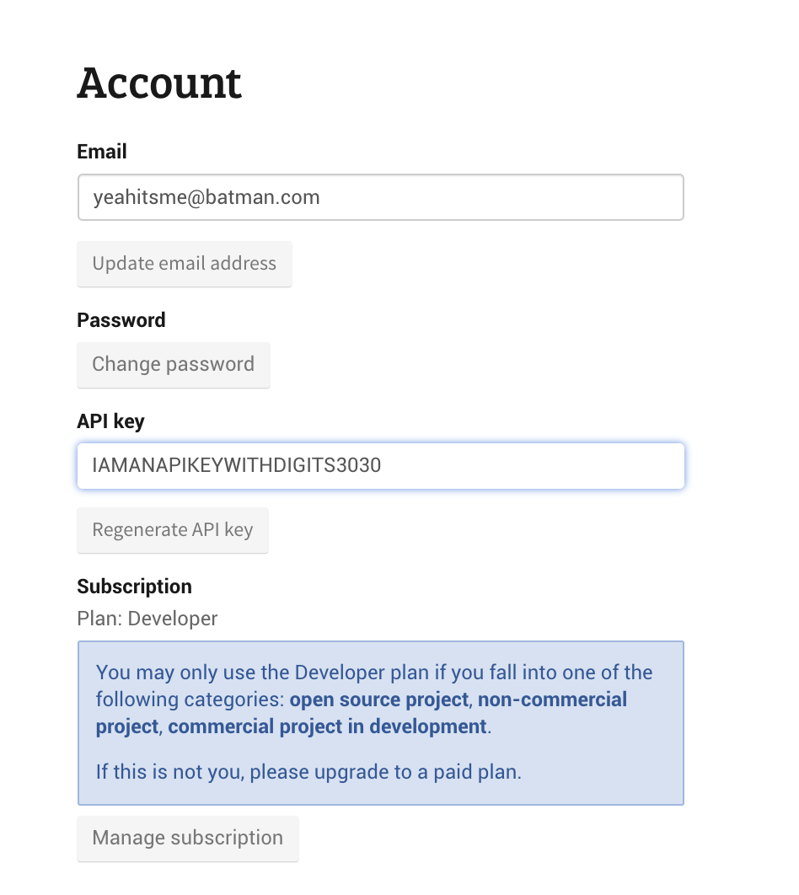

<p align="center">
  <a href="http://bit.ly/2Mw9Szs" target="blank"></a>
</p>
<p align="center">A <a href="https://graphql.org/" target="_blank">GraphQL</a> REST wrapper example using the <a href="https://newsapi.org"
    target="_blank">NewsAPI</a> build with the <a href="https://nestjs.com/" target="_blank">NestJS</a> Framework</p>


> Recently updated with [nestjs `v6.11`](https://github.com/nestjs/nest/releases/tag/v6.11.0)


Check out the repo's [wiki](https://github.com/rajinwonderland/nest-graphql-newsapi/wiki/Home) for more information!


## Demos
<br/>
 <a href="https://codesandbox.io/s/4r84973oj9?autoresize=1&expanddevtools=1&hidenavigation=1&view=editor" target="_blank">
    
  </a>

## Background

Came across the [NestJS](https://nestjs.org) while experimenting with different [Typescript](https://www.typescriptlang.org/) based frameworks for [GraphQL](https://graphql.org) specific use cases.
- Official NestJS [Documentation for use with GraphQL](https://docs.nestjs.com/graphql/quick-start)
- Official NestJS [GraphQL example](https://github.com/nestjs/nest/tree/master/sample/12-graphql-apollo)

## Prerequisites

If you don't have a [**NewsAPI**](https://newsapi.org) account or api token available, please follow the steps in order to get the app running!

### Step 1:

[Login](https://newsapi.org/login) or [Register](https://newsapi.org/register) for [NewsAPI](https://newsapi.org)

### Step 2:

Go to [your account page](https://newsapi.org/account) and copy your API Token

<figure>

<figcaption>Example NewsAPI Account Page</figcaption>
</figure>

### Step 3:

Create a new `.env` file and add the following environment variable

```sh
echo NEWS_API_KEY="CANTYOUSEEIMSELFAWAREWITHDIGITS3030" >> .env
```

> Note: you can also just rename the `.env.sample` to `.env` and replace the key there

```sh
GRAPHQL_ENV=development
NEWS_API_KEY="SOMEONEPLEASEHELPMEWITHDIGITS3030"
PORT=3000 # or your preferred port
```

## Installation

### Clone the repo!

```sh
git clone https://github.com/rajinwonderland/nest-graphql-newsapi
```

### Install dependencies

```sh
yarn
```
> OR `npm i`

### Start the App

```sh
yarn dev
```

The browser should then open automatically on to the [graphql-playground](https://github.com/prisma-labs/graphql-playground) page

> **Note**: Default playground should be available at http://localhost:3000/graphql

Unless you changed the `PORT` environment variable in which case your playground should be hosted at
`http://localhost:${YOUR_PORT}/graphql`

## Example

### Top Headlines Example

Query for returning `TopHeadlines`

```graphql
query TopHeadlines($query: String!, $options: HeadlineInput) {
	topHeadlines(q: $query, options: $options) {
		status
		totalResults
		articles {
			title
			description
			author
		}
	}
}
```

**Variables** for our `TopHeadlines` Query

```json
{
	"query": "API Keys",
	"options": {
		"pageSize": 5,
		"page": 1
	}
}
```

**Results** should end up showing in this sort of format

```json
{
	"data": {
		"topHeadlines": {
			"status": "ok",
			"totalResults": 3,
			"articles": [
				{
					"title": "Did you know API Keys are Self Aware?!",
					"description": "Secure and treat your API Keys with respect",
					"author": "YOUR API KEY... WITHDIGITS3030"
				}
			]
		}
	}
}
```

See the example on [GraphQLBin](https://www.graphqlbin.com/v2/oZQ1tP)

## Built With
- [NestJS](https://docs.nestjs.com) - A progressive Node.js framework for building efficient, reliable and scalable server-side applications.
- [NewsAPI](https://newsapi.org) - Up-to-date news headlines and metadata in JSON from 70+ popular news sites.
- [newsapi (Node Client)](https://www.npmjs.com/package/newsapi)- A node client for NewsAPI.
- [GraphQL](https://graphql.org/) a query language for your API
- [Typescript](https://github.com/Microsoft/TypeScript) a superset of JavaScript that compiles to clean JavaScript output
- [CodeSandbox](https://codesandbox.io) is an online code editor with a focus on creating and sharing web application projects.
- [GraphQL-Playground](https://github.com/prisma-labs/graphql-playground) a GraphQL IDE for better development workflows (GraphQL Subscriptions, interactive docs & collaboration).


> The updated version of this api had to exclude the following dependencies in order to deploy to render.com. This is due to a downstream dependency issue on `@nestjs/graphql` – see [zeit/now #3115](https://github.com/zeit/now/issues/3115) and [TrilonIO/zeit-now-nestjs #2](https://github.com/TrilonIO/zeit-now-nestjs/issues/2))
>  - [Fastify](https://www.fastify.io/) a fast and low overhead web framework for Node.js
>  - [Apollo Server Fastify](https://github.com/apollographql/apollo-server/tree/master/packages/apollo-server-fastify) – This is the [Fastify](https://github.com/fastify/fastify) integration of GraphQL Server. Apollo Server is a community-maintained open-source GraphQL server that works with many Node.js HTTP server frameworks.


Feel free to reach out with via [Issues](/issues), [Twitter](https://twitter.com/rajinwonderland) and/or [PRs](/pulls) with a tag [@rajinwonderland](https://github.com/rajinwonderland)

---

<p align="right">Powered by <a href="https://newsapi.org" target="_blank">NewsAPI.org</a>
</p>